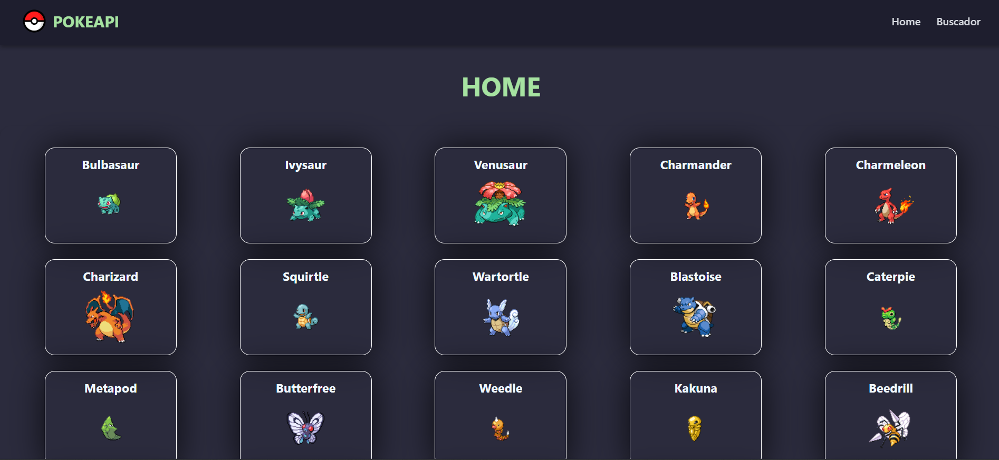

# PokeAPI v1 - Proyecto en React

🌐 **Aplicación interactiva utilizando React** que consume la [PokeAPI](https://pokeapi.co/) para mostrar información sobre Pokémon.

## 📝 Detalles del proyecto
- **Descripción:** Este proyecto tiene como objetivo crear una aplicación en React que permita visualizar y buscar Pokémon de manera sencilla.
- **Estado:** Terminado.

## 🚀 Demo en vivo
Puedes ver el resultado final en el siguiente enlace:  
[PokeApi v1 - GitHub Pages](https://fbarrerac.github.io/pokeapi-react-v1/)

## 📸 Captura del diseño

## 🛠 Tecnologías utilizadas
- **React**: Librería JavaScript para la construcción de interfaces de usuario.
- **React Router**: Para manejar las rutas y la navegación entre páginas.
- **CSS**: Estilos y diseño de la aplicación.

## 🏗 Funcionalidades
- **Visualización de Pokémon:** Pokémon con sus detalles básicos.
- **Búsqueda de Pokémon:** Campo de búsqueda para filtrar por nombre o ID.
- **Paginación:** Soporte para manejar grandes cantidades de Pokémon.

## 🚧 Estado del proyecto
Este proyecto está terminado y está en su **versión inicial**. En un futuro haré la v2. Puede que esta versión presente algunos errores.

## 🧑‍💻 Autor
Desarrollado por [fbarrerac](https://github.com/fbarrerac). 

